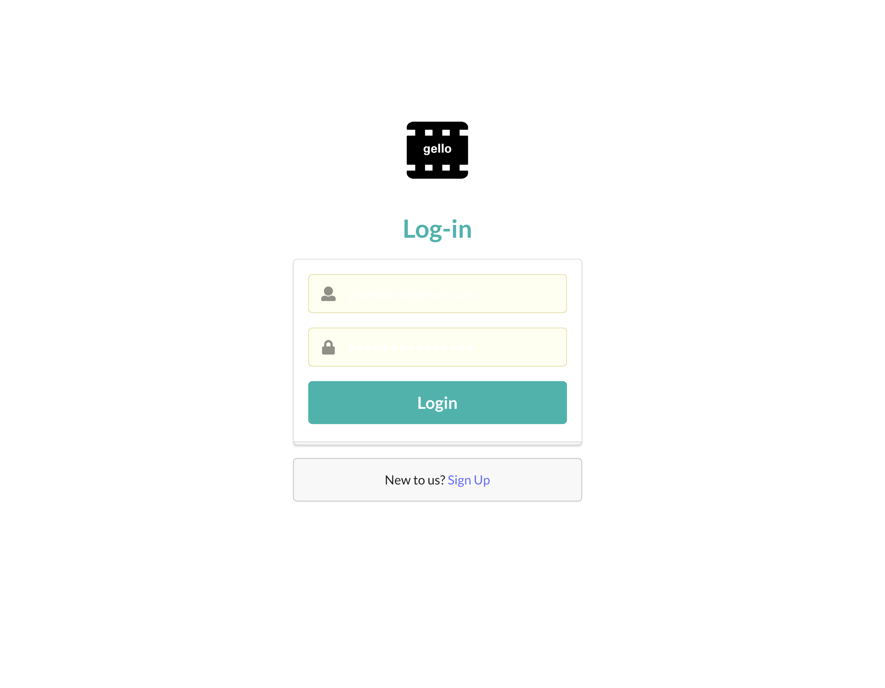
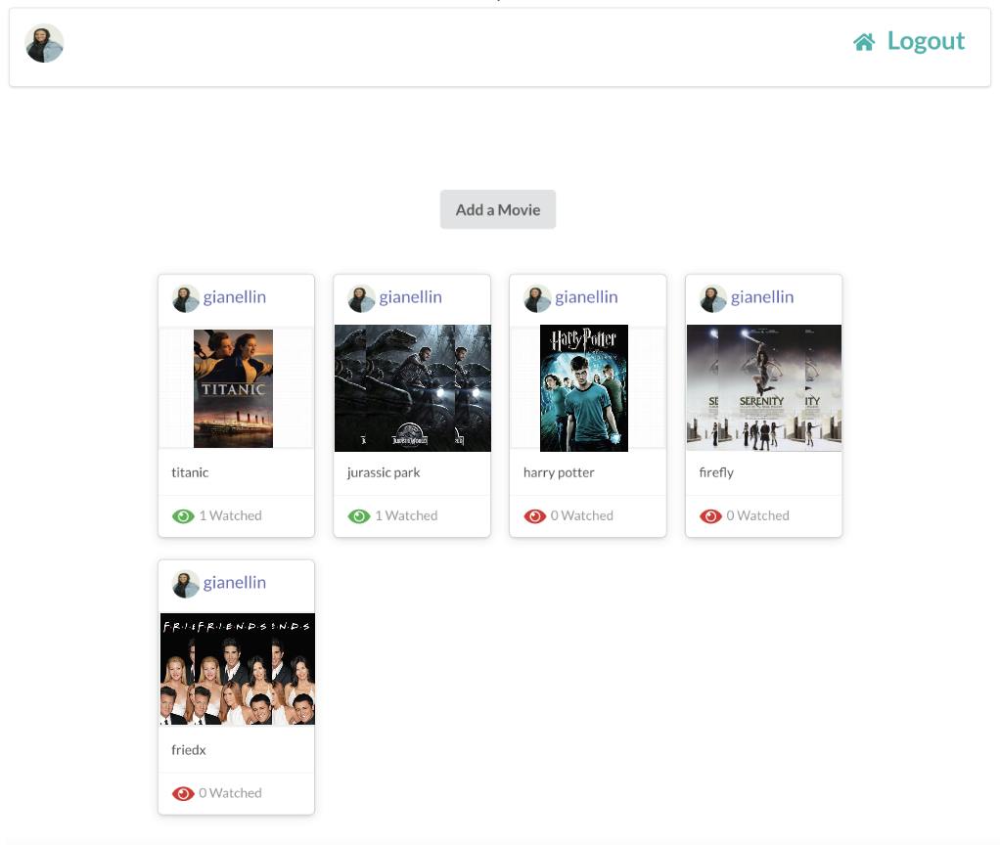
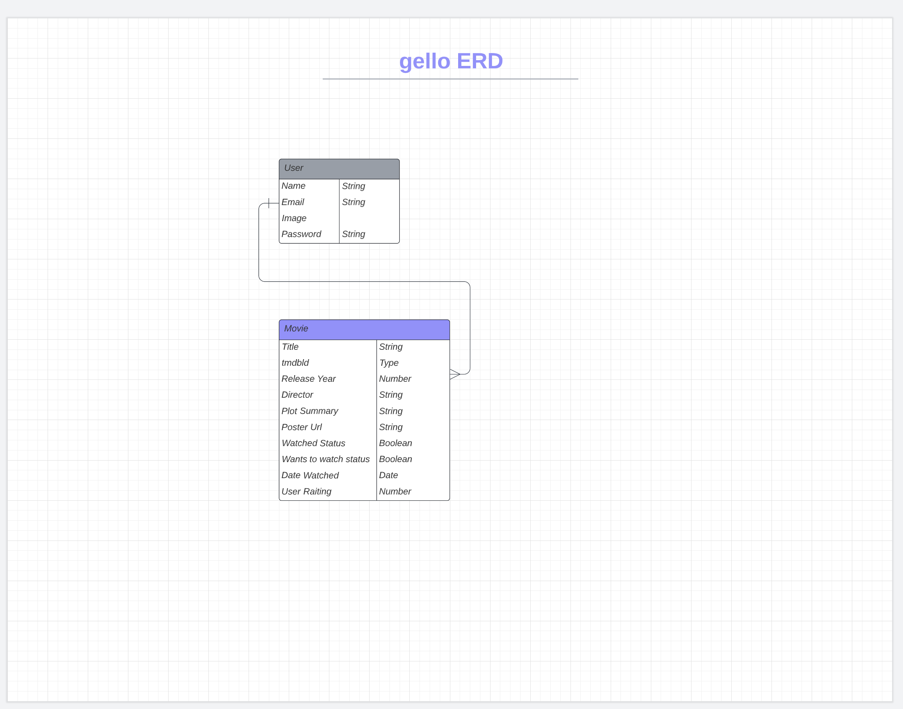

# gello

## Introduction

Gello is an application that allows you to track, rate, and share both the movies you like in one seamless single page application. Gello, a universe of film to explore!

## Planning

[Trello Board](https://trello.com/invite/b/55Q6wa90/ATTI088e3813f57a04cd87d918f518f7483bCA46D85F/gello)

### Deployed Link:

[gello]()

## Technologies

- React
- HTML/CSS/JS
- Node/Express
- MongoDB
- JSON Web Tokens
- Bcrypt

## Future Enhancements

- Mobile responsiveness
- Add sort options to both library and compare functionalities
- Dashboard to display data on user viewing habits
- Allow for comparison between two users or more.
- Add more edit features.
- Connect to movie DB for a more seamless experience.